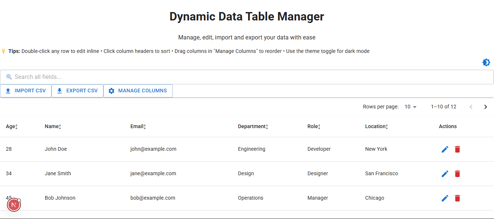
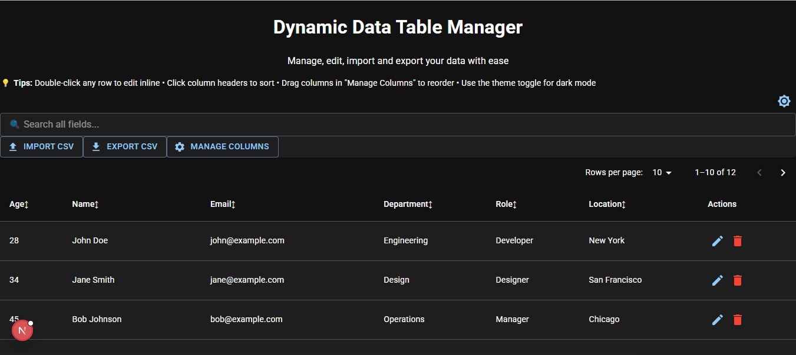
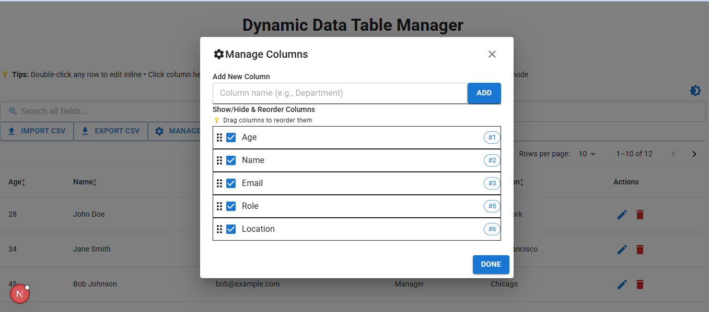
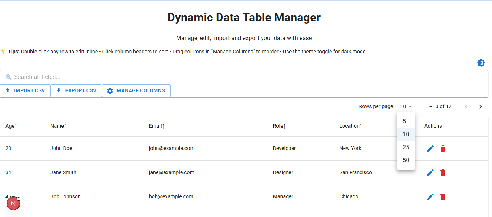
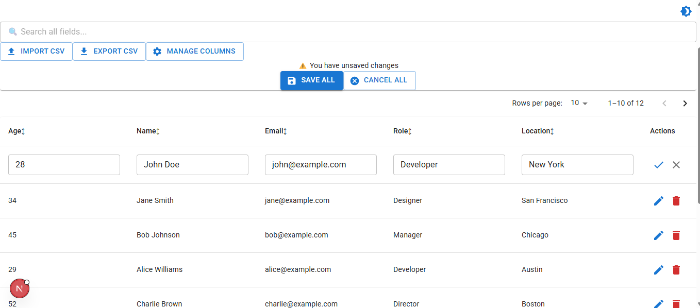

# Dynamic Data Table Manager

This project is a frontend assignment built using **Next.js**, **Redux Toolkit**, and **Material UI (MUI)**.  
It demonstrates the ability to build a production-level, dynamic user interface with advanced table features, state management, and responsive design.

---

## Project Overview

The **Dynamic Data Table Manager** allows users to view, search, sort, and manage tabular data with ease.  
It supports importing and exporting CSV files, toggling between light and dark themes, and editing rows inline.  
The application is built to simulate real-world dashboard functionality, emphasizing performance, scalability, and maintainability.

---

## Core Features

### 1. Table View
- Displays a table with default columns: **Name**, **Email**, **Age**, **Role**
- Supports sorting on column headers (ASC/DESC toggle)
- Global search that filters across all columns
- Client-side pagination (10 rows per page)

### 2. Dynamic Columns
- Manage Columns modal allows users to:
  - Add new columns dynamically (e.g., Department, Location)
  - Show or hide existing columns
- Column visibility preferences are persisted in **localStorage** or **Redux Persist**

### 3. Import & Export
- **Import CSV**
  - Upload and parse CSV files using **PapaParse**
  - Validate file format and show error messages for invalid data
- **Export CSV**
  - Export the current table view as a `.csv` file
  - Only visible columns are included in the exported file

---

## Bonus Features

- Inline row editing with validation (e.g., age must be a number)
- "Save All" and "Cancel All" buttons for batch editing
- Row actions: **Edit**, **Delete** (with confirmation dialog)
- Theme toggle: light/dark mode using MUI theming
- Column reordering via drag-and-drop
- Fully responsive UI

---

## Tech Stack

| Technology | Purpose |
|-------------|----------|
| **Next.js 14 (App Router)** | Framework for server-rendered React apps |
| **React 18** | Component-based UI library |
| **Redux Toolkit** | Global state management |
| **Material UI (v5+)** | UI components and theming |
| **TypeScript** | Static typing for safer, cleaner code |
| **React Hook Form** | Form handling and validation |
| **PapaParse** | CSV parsing |
| **FileSaver.js / Blob** | CSV export |
| **Redux Persist / localStorage** | Persist user preferences |

---

## Folder Structure

project-root/
│
├── app/
│ ├── layout.tsx
│ ├── page.tsx
│ └── api/
│
├── components/
│ ├── DataTable.tsx
│ ├── ManageColumnsModal.tsx
│ └── DeleteConfirmDialog.tsx
│
├── hooks/
│ ├── useTableData.ts
│ ├── useTableEdit.ts
│ ├── useTableActions.ts
│ └── useCSVOperations.ts
│
├── redux/
│ ├── store.ts
│ └── slices/
│ └── tableSlice.ts
│
├── types/
│ └── index.ts
│
├── public/
│ ├── sample-data.csv
│ └── screesnShots/
│ ├── light.png
│ ├── dark.png
│ ├── edit-column.png
│ ├── pagination.png
│ └── save-all.png
│
├── package.json
└── README.md

yaml
Copy code

---

## How to Run the Project Locally

### Prerequisites
Ensure you have the following installed:
- **Node.js v18 or higher**
- **npm** or **yarn**

### Steps

1. **Clone the repository**
   ```bash
   git clone https://github.com/yourusername/dynamic-data-table-manager.git
   cd dynamic-data-table-manager
Install dependencies

bash
Copy code
npm install
Run the development server

bash
Copy code
npm run dev
Open the application
Visit: http://localhost:3000

Build for Production
bash
Copy code
npm run build
npm run start
## 📸 Screenshots

### 1. Mian Table


### 3. Dark Mode


### 3. Edit Column Moodal


### 4. Client Side Pagination


### 5. Row Edit


Evaluation Notes
This project demonstrates:

Component-based design with separation of concerns

Proper use of Redux Toolkit for managing complex UI state

Integration of MUI for theming and consistent design

CSV import/export handling using browser APIs

TypeScript for type safety and maintainability

Fully responsive and accessible design

Made by
Raunak Kumar
GitHub: https://github.com/Rocky4554
LinkedIn: https://www.linkedin.com/in/raunak-kumar54/